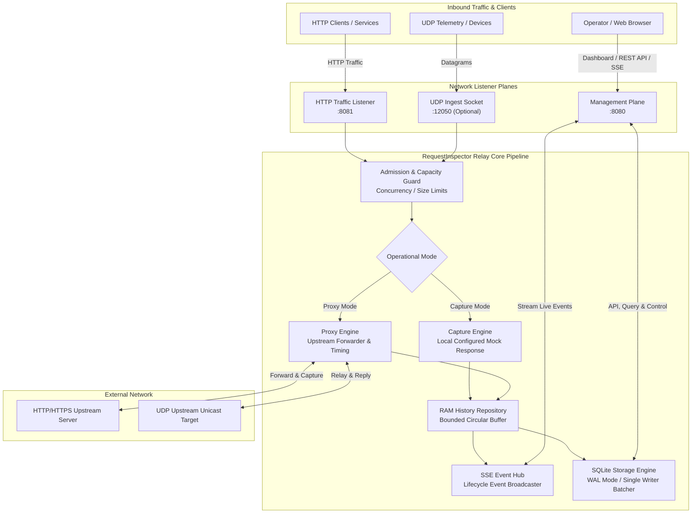

# RequestInspector Relay

[](https://golang.org)
[](LICENSE)
[](#download--installation)
[](#run-with-docker)

**RequestInspector Relay** (`reqrelay`) is a lightweight, self-hosted, zero-dependency **local debugging and API inspection tool** for **HTTP/1.1** and **UDP** traffic. It ships as a single static binary with an embedded modern **SvelteKit** web interface and acts as a programmable reverse proxy that captures, displays, and persists every request and response flowing through it.

Whether debugging webhook payloads, inspecting microservice traffic, stress-testing APIs with mock responses, or analyzing UDP telemetry datagrams, RequestInspector Relay captures raw bytes, provides deep visual inspection, and persists history safely without impacting upstream performance.

> [!NOTE]
> **RequestInspector Relay is a developer tool for local debugging and inspection.** It is not designed to replace production reverse proxies, load balancers, or API gateways (e.g., Nginx, Envoy, Traefik). Use it during development, testing, and troubleshooting to gain full visibility into API traffic.

> [!TIP]
> **Free Online Request Inspection:** Looking for instant online request inspection without running local infrastructure? Use the free hosted service at **[requestinspector.com](http://requestinspector.com)**.

---

## Key Features

- **Dual Transport Protocols**:
  - **HTTP/1.1**: Full request/response capture, hop-by-hop sanitization, chunked Range streaming, and non-destructive decoding for `gzip` and `deflate`.
  - **UDP**: Unicast datagram capture, client-session tracking with TTL, fixed mock datagram replies, and safe upstream relay.
- **Dual Operating Modes**:
  - **Capture Mode**: Ingests traffic and returns fully customizable local mock responses (status code, headers, and body) without touching any external service.
  - **Proxy Mode**: Transparently forwards traffic to a designated upstream target, capturing both request and upstream response with microsecond-level phase timings.
- **Realtime & Historical Observability**:
  - **Realtime Feed**: Live Server-Sent Events (SSE) feed presenting newly captured requests in a reactive, newest-first stream.
  - **Persistent History**: Embedded SQLite backend (WAL mode, pure-Go `modernc.org/sqlite`) with deduplication, automated retention cleanups, vacuum, and stable cursor pagination.
- **Interactive Deep Inspector**:
  - Auto-formatted JSON tree view, bounded Hex/Text viewer, escaped Raw view, and instant header/payload copy.
  - Bounded 64 KiB Range requests for fast, safe loading of large payloads.
- **Zero-Downtime Hot Reload**:
  - Reconfigure or change listener ports (Management, HTTP Ingest, UDP Ingest) on the fly via web interface or API.
  - Atomic port pre-flight checks prevent invalid configurations from interrupting active listeners.
- **Single Binary / Container Ready**:
  - Embedded SvelteKit SPA (offline-ready PWA, responsive design, WCAG AA contrast).
  - CGO-free releases for Linux (AMD64, ARM64, ARMv7), Windows, and macOS. Official multi-arch Docker image.

---

## Architecture

RequestInspector Relay isolates management operations from traffic ingestion across separate listener planes. Traffic moves through a bounded admission pipeline, persists terminal events to SQLite, and broadcasts lifecycle updates over Server-Sent Events to connected browsers.



---


## Download & Installation

Pre-compiled, zero-dependency, CGO-free single binaries are published for every release on [GitHub Releases](https://github.com/logocomune/requestinspector-relay/releases).

### Supported Platforms & Architectures

| OS | Architecture | Target Hardware / Platform | Archive Name |
| :--- | :--- | :--- | :--- |
| **Linux** | `x86_64` (amd64) | Modern 64-bit Linux servers, desktops, cloud VMs | `reqrelay_linux_x86_64.tar.gz` |
| **Linux** | `arm64` (aarch64) | Raspberry Pi 4/5 (64-bit OS), AWS Graviton, modern ARM SBCs | `reqrelay_linux_arm64.tar.gz` |
| **Linux** | `armv7` (armhf) | Raspberry Pi 2/3 (32-bit OS), IoT gateways, embedded ARM | `reqrelay_linux_armv7.tar.gz` |
| **macOS** | `arm64` | Apple Silicon (M1, M2, M3, M4, Mac Studio, MacBook) | `reqrelay_darwin_arm64.tar.gz` |
| **macOS** | `x86_64` | Intel-based Macs | `reqrelay_darwin_x86_64.tar.gz` |
| **Windows** | `x86_64` (amd64) | 64-bit Windows desktops, Windows Server | `reqrelay_windows_x86_64.zip` |
| **Windows** | `arm64` | Windows on ARM (Snapdragon X Elite, Surface Pro) | `reqrelay_windows_arm64.zip` |

---

### Quick Download Examples

#### Linux (x86_64, ARM64, ARMv7)

Download and extract the binary directly using `curl` and `tar`:

```sh
# Choose target archive: x86_64 | arm64 | armv7
ARCH="x86_64"

curl -sSL "https://github.com/logocomune/requestinspector-relay/releases/latest/download/reqrelay_linux_${ARCH}.tar.gz" | tar -xz

# Run
./reqrelay
```

#### macOS (Apple Silicon & Intel)

```sh
# Choose architecture: darwin_arm64 (Apple Silicon) or darwin_x86_64 (Intel)
ARCH="darwin_arm64"

curl -sSL "https://github.com/logocomune/requestinspector-relay/releases/latest/download/reqrelay_${ARCH}.tar.gz" | tar -xz

# Remove quarantine attribute if blocked by macOS Gatekeeper:
xattr -d com.apple.quarantine ./reqrelay 2>/dev/null || true

# Run
./reqrelay
```

#### Windows (PowerShell)

```powershell
# In PowerShell:
$ARCH = "x86_64" # or arm64

Invoke-WebRequest -Uri "https://github.com/logocomune/requestinspector-relay/releases/latest/download/reqrelay_windows_${ARCH}.zip" -OutFile "reqrelay.zip"
Expand-Archive -Path "reqrelay.zip" -DestinationPath "."

# Run
.\reqrelay.exe
```

#### Verifying Release Integrity

Each release includes SHA-256 hashes in `checksums.txt`:

```sh
curl -sSLO "https://github.com/logocomune/requestinspector-relay/releases/latest/download/checksums.txt"
sha256sum --ignore-missing -c checksums.txt
```

---

## Quick Start

### 1. Run from Source (Go)

Ensure Go 1.24+ is installed:

```sh
go run ./cmd/reqrelay
```

On successful boot, the console displays the build version and listener URLs:
- **Management Dashboard & API**: `http://127.0.0.1:8080`
- **HTTP Traffic Ingest**: `http://0.0.0.0:8081`
- **UDP Ingest**: Disabled by default (`0.0.0.0:12050` when enabled)

Send a test request to the traffic listener:

```sh
curl -i http://127.0.0.1:8081/hello -d '{"message": "hello world"}'
```

Open `http://127.0.0.1:8080` in your browser to inspect the captured request in Realtime.

---

### 2. Run with Docker

Run the container with persistent storage for configuration and database:

```sh
# Pull the latest image
docker pull ghcr.io/logocomune/requestinspector-relay:latest

# Run with persistent storage
docker run --rm -d \
  --name reqrelay \
  --network host \
  -v reqrelay-data:/data \
  ghcr.io/logocomune/requestinspector-relay:latest
```

The container automatically persists runtime configuration at `/data/reqrelay.yaml` and database files at `/data/reqrelay.db`.

---

## Default Network Endpoints

| Plane | Default Binding | Protocol | Purpose |
| :--- | :--- | :--- | :--- |
| **Management** | `127.0.0.1:8080` | HTTP | Web UI, REST API (`/api/v1`), SSE stream (`/api/v1/events`) |
| **HTTP Traffic** | `0.0.0.0:8081` | HTTP | Ingestion endpoint for requests to inspect or proxy |
| **UDP Ingest** | `0.0.0.0:12050` | UDP | Optional datagram ingestion endpoint (Disabled by default) |

---

## Operating Modes

### Capture Mode
Capture mode acts as a programmable black hole and mock endpoint:
- Ingests incoming HTTP requests or UDP datagrams.
- Records all headers, parameters, and raw payload bytes.
- Returns the pre-configured mock response (HTTP status, custom headers, body).
- **Zero Upstream Calls**: Ideal for decoupling downstream clients during development, sinkholing webhooks, or mocking external APIs.

### Proxy Mode
Proxy mode operates as a transparent reverse proxy:
- Forwards requests to a target `upstream.url` (HTTP/HTTPS) or `udp.upstream`.
- Preserves HTTP methods, query parameters, repeated headers, and compressed payloads.
- Removes standard hop-by-hop headers and accurately reconstructs `X-Forwarded-*` headers.
- Records high-resolution phase durations:
  - `upstream_dispatch_duration_us`: Time to connect and transmit the request.
  - `upstream_wait_duration_us`: Time waiting for the first upstream response byte (TTFB).
  - `upstream_receive_duration_us`: Time to ingest the complete response body.
  - `downstream_write_duration_us`: Time spent streaming buffered bytes back to the caller.

---

## Configuration

RequestInspector Relay resolves configuration hierarchically (highest precedence first):

```text
Persistent UI Overrides ➔ CLI Flags ➔ Environment Variables ➔ YAML File ➔ Built-in Defaults
```

### Configuration File Example (`reqrelay.yaml`)

```yaml
mode: proxy

listeners:
  management: 127.0.0.1:8080
  traffic: 0.0.0.0:8081

upstream:
  url: https://httpbin.org
  timeout: 30s

capture_response:
  status: 200
  headers:
    Content-Type:
      - application/json
  body: '{"status":"ok"}'

limits:
  concurrent_exchanges: 128
  request_body_bytes: 1048576      # 1 MiB
  response_body_bytes: 1048576     # 1 MiB
  request_header_bytes: 65536      # 64 KiB
  response_header_bytes: 65536     # 64 KiB

storage:
  mode: sqlite                     # "memory" or "sqlite"
  retention_days: 7                # 0 disables automated deletion

authentication:
  username: "admin"
  password: "change-me"
  session_ttl: 24h

udp:
  enabled: false
  listen: 0.0.0.0:12050
  mode: capture
  max_datagram_bytes: 65507
  max_sessions: 1024
```

### Environment Variable Overrides

Any setting can be configured via environment variables prefixed with `REQRELAY_`:
- `REQRELAY_MODE=proxy`
- `REQRELAY_LISTENERS_TRAFFIC=0.0.0.0:8081`
- `REQRELAY_UPSTREAM_URL=https://api.example.com`
- `REQRELAY_STORAGE_MODE=sqlite`
- `REQRELAY_AUTHENTICATION_USERNAME=admin`
- `REQRELAY_AUTHENTICATION_PASSWORD=secret`

---

## Development & Building

### Prerequisites
- **Go**: 1.24 or later
- **Node.js**: 24+ and **npm**

### Build Frontend
The web UI is written in SvelteKit and bundled into Go assets:

```sh
cd web
npm ci
npm run check          # Type checking
npm run check:credits  # Verify license and dependencies catalog
npm test               # Run Vitest suite
npm run build          # Compile production assets to embed
cd ..
```

### Build Binary
Compile the single executable with embedded web frontend:

```sh
go build -o reqrelay ./cmd/reqrelay
```

### Cross-Platform Release Build
A build script generates CGO-free binaries for all supported platforms:

```sh
./scripts/build-release.sh
```

Compiled targets will be placed in `dist/release/`:
- `linux/amd64`, `linux/arm64`, `linux/armv7`
- `darwin/amd64`, `darwin/arm64`
- `windows/amd64`

---

## Management REST API & SSE

The Management plane (`:8080`) provides a frozen Version 1 API:

- `GET /api/v1/health` - Health check status.
- `GET /api/v1/status` - Live runtime metrics, storage statistics, and active listeners.
- `GET /api/v1/events` - Server-Sent Events (SSE) live lifecycle stream with replay support (`Last-Event-ID`).
- `GET /api/v1/exchanges` - Query captured exchanges with cursor-based pagination and filtering.
- `GET /api/v1/exchanges/{id}` - Full exchange details and metadata.
- `GET /api/v1/exchanges/{id}/request/body` - Raw request body (supports HTTP Range headers).
- `GET /api/v1/exchanges/{id}/response/body` - Raw response body (supports HTTP Range headers).
- `DELETE /api/v1/exchanges/{id}` - Purge an exchange from RAM and SQLite.
- `GET /api/v1/config` - Inspect running configuration without leaking credentials.
- `PUT /api/v1/config` - Atomic runtime settings update and hot reload.
- `POST /api/v1/storage/sqlite/vacuum` - Perform database compaction and vacuum.

---

## AI Disclosure

> **AI Development Disclosure:**
> This software was developed and maintained with the assistance of Artificial Intelligence (AI) tools and Large Language Models (LLMs) for system architecture design, code implementation, automated testing, documentation, and refactoring.

---

## Disclaimer & Limitation of Liability

```text
THIS SOFTWARE IS PROVIDED BY THE COPYRIGHT HOLDERS AND CONTRIBUTORS "AS IS"
AND ANY EXPRESS OR IMPLIED WARRANTIES, INCLUDING, BUT NOT LIMITED TO, THE
IMPLIED WARRANTIES OF MERCHANTABILITY AND FITNESS FOR A PARTICULAR PURPOSE ARE
DISCLAIMED. IN NO EVENT SHALL THE COPYRIGHT OWNER OR CONTRIBUTORS BE LIABLE
FOR ANY DIRECT, INDIRECT, INCIDENTAL, SPECIAL, EXEMPLARY, OR CONSEQUENTIAL
DAMAGES (INCLUDING, BUT NOT LIMITED TO, PROCUREMENT OF SUBSTITUTE GOODS OR
SERVICES; LOSS OF USE, DATA, OR PROFITS; OR BUSINESS INTERRUPTION) HOWEVER
CAUSED AND ON ANY THEORY OF LIABILITY, WHETHER IN CONTRACT, STRICT LIABILITY,
OR TORT (INCLUDING NEGLIGENCE OR OTHERWISE) ARISING IN ANY WAY OUT OF THE USE
OF THIS SOFTWARE, EVEN IF ADVISED OF THE POSSIBILITY OF SUCH DAMAGE.
```

---

## Documentation Index

For in-depth guides and architectural references, explore the `./docs` directory:

- [Shared Request Pipeline](docs/request-pipeline.md)
- [Capture Mode Specification](docs/capture-mode.md)
- [Proxy Mode Specification](docs/proxy-mode.md)
- [Realtime & History Interface](docs/realtime-history.md)
- [SQLite History & Storage Maintenance](docs/sqlite-history.md)
- [UDP Security & Operational Guidelines](docs/udp-security.md)
- [Configuration Reference & Hot Reload](docs/configuration.md)
- [Management API v1 Contract](docs/api-v1.md)
- [Settings & Administration](docs/settings-and-information.md)
- [Frontend Foundation & Architecture](docs/frontend-foundation.md)
- [Build & Release Matrix](docs/backend-readiness.md)
